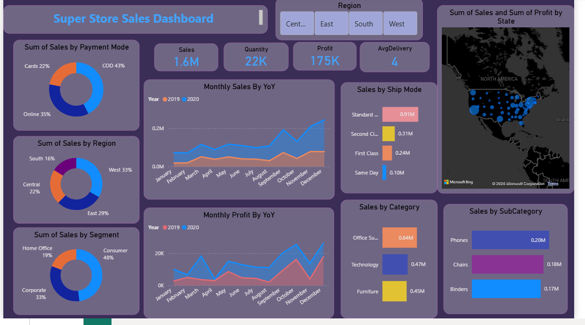

# Ecommerce Sales Analysis – Power BI Dashboard

This project showcases an **interactive Ecommerce Sales Dashboard** developed using **Power BI**, focusing on sales performance, trends, and business insights.

## 📌 Project Overview
- Cleaned and analyzed ecommerce transaction data
- Performed data transformation using Power Query
- Built an advanced, interactive dashboard for business analysis
- Designed for real-world **Data Analyst portfolio use**

## 📊 Dashboard Features
- Total Sales KPI
- Monthly sales trends
- Country-wise sales distribution
- Top-selling products analysis
- Quantity and revenue insights

## 🛠 Tools & Technologies
- Power BI
- Power Query (Data Cleaning)
- CSV / Excel
- Data Visualization & Analysis

## 📁 Repository Structure
- `dashboard.pbix` – Power BI dashboard file
- `dashboard_overview.png` – Dashboard preview image
- `ecommerce_cleaned.csv` – Cleaned dataset (if included)

## 🖼 Dashboard Preview

## 🎯 Key Skills Demonstrated
- Data Cleaning & Transformation
- Exploratory Data Analysis (EDA)
- Business-focused dashboard design
- Analytical thinking & visualization

## 👤 Author
**Hamais Ahmed**  
Aspiring Data Analyst / ML Intern  
Pakistan  

🔗 GitHub: https://github.com/hamaisahmed862-netizen
